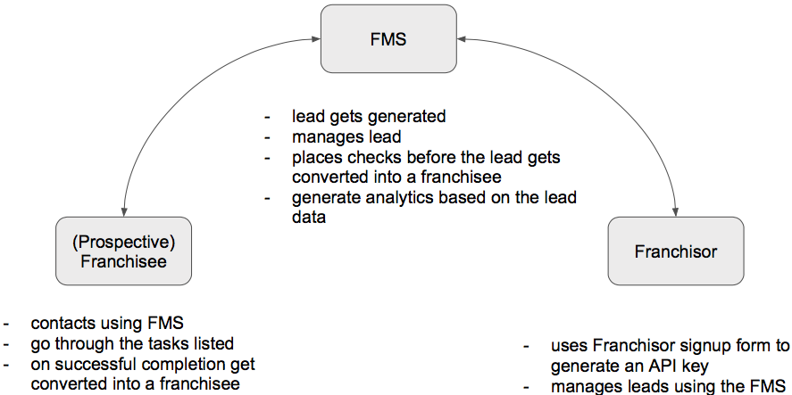
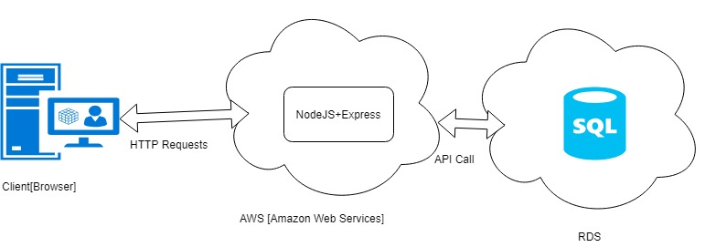
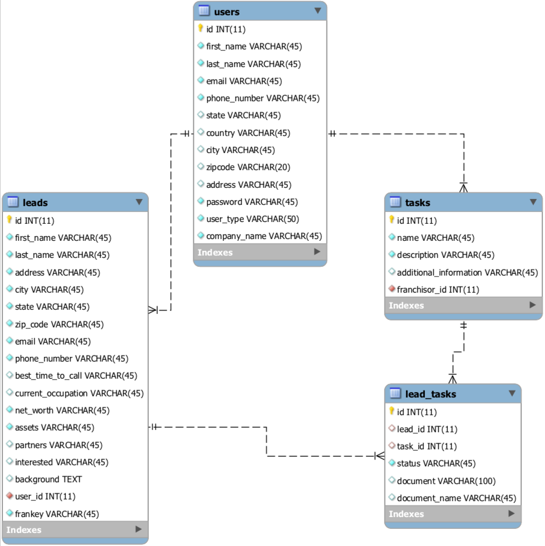
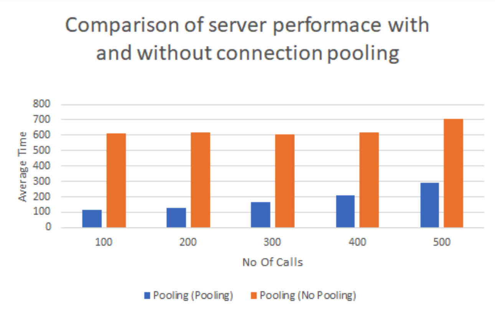
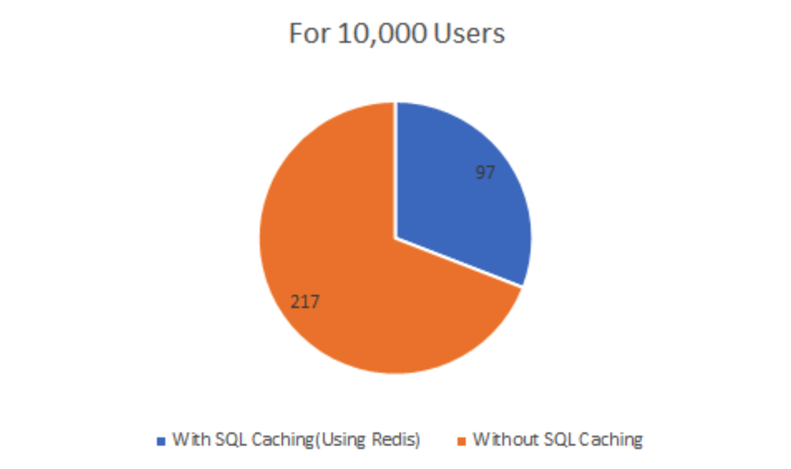
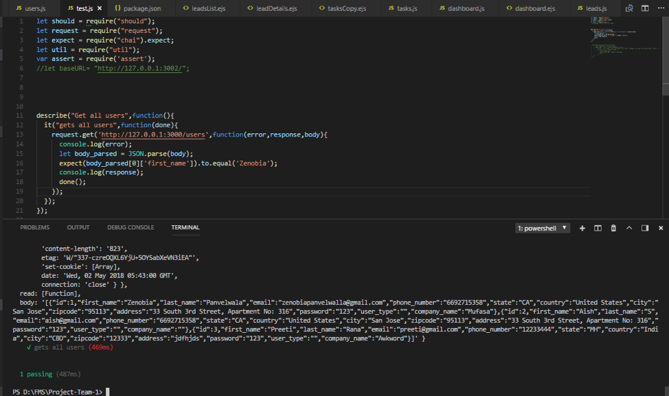
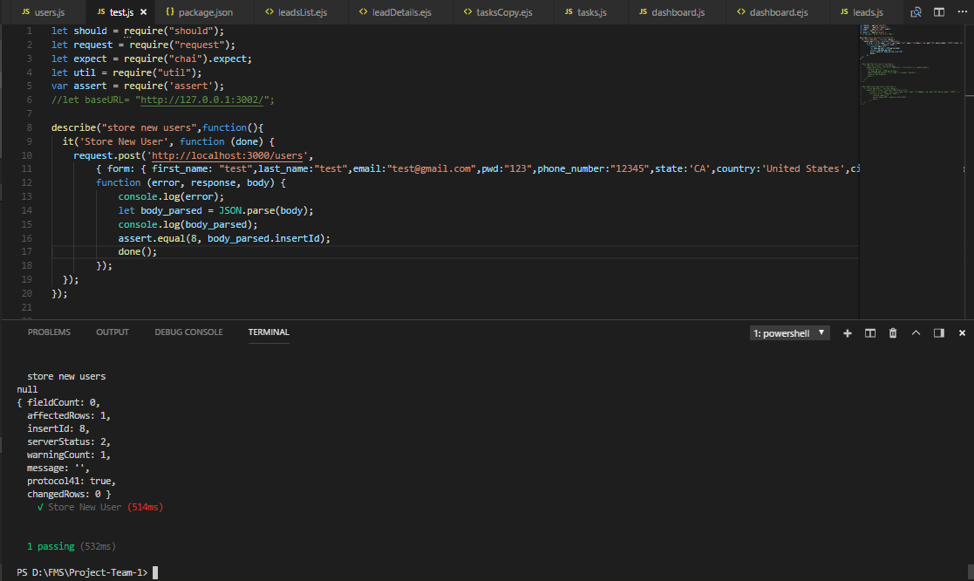
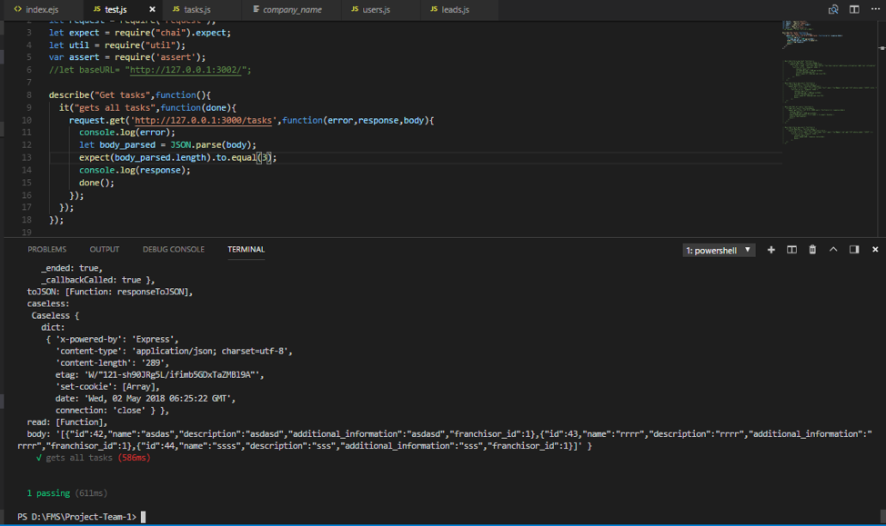
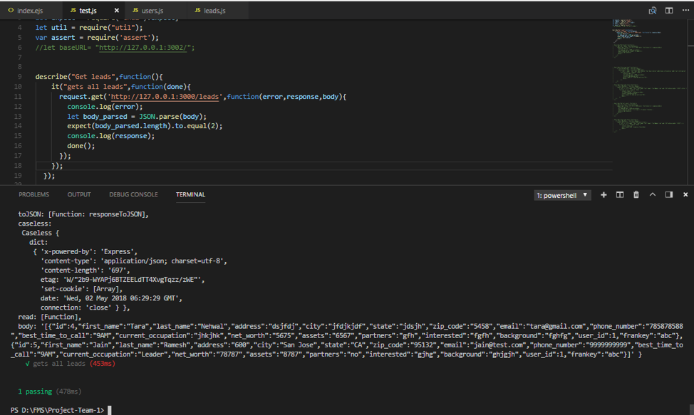
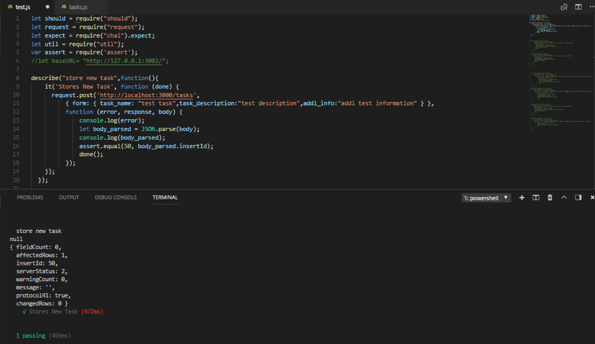

# LEMUR - LEad Management Update & Reporting (Franchise Management System)
Project Team #1

Team Members: Aishwarya Saxena, Aprajita, Tong Wu,Zenobia Adnan Panvelwala.

# Abstract
After marketing a franchise system successfully, a good franchisor will provide meaningful support and guidance to the new franchise partners on a consistent basis. The value of a franchise model should add up to much more than just the collection of a franchise fee. There should be substantial value 6 months, 2 years and even 10 years into the franchise relationship. Like any marketing or sales model, it is much more efficient and profitable for a franchisor to retain happy, profitable franchisees than to continue going out and looking for new ones.

# Introduction
LEad Management Update & Report is a Franchise Management System (FMS), which does a few things:
 - assist with the onboarding of new franchisees
 - manage leads and let franchisor to set up criteria for the leads
 - select the desired lead to become a franchisee
 - keep track of revenue of each franchisee is making

 

# Personas
1. **Andrew, the FMS admin**
Andrew, a 40 something man lives in Campbell. He works at Cheezy Pizza HQ in San Jose downtown. In early stages of his career, he started out as a server and worked his way up to the admin department. With his hands-on knowledge of how restaurant works and his quest to climb up in his career, he has managed to come this far.
Andrew's work involves reviewing the franchisee applications, getting in touch with them to ascertain if they suit, maintain records of suitable applications, and do follow-ups if required.
He thinks a lot of work done by him is repetitive, and consumes a lot of time, not to mention it bores him sometimes to go over records manually, and update everything manually. He feels an automated system to update & keep a track of tasks-list would free up his time to process more applications in a timely manner.  

2. **Bob, operations manager at Cheezy Pizza**
Bob is a 35 year old Operations manager at Cheezy Pizza admin department. He is an MBA grad, and has been roped in to increase company's revenue generated via lead management. One of his core jobs is to communicate with other management professionals within the organization to keep the company running smoothly, and communicating with other companies and organizations with which the company does business. He is responsible for putting together reports and financial statements that are essential for other top executives within the company or organization. 
He is interested in a system that will allow him to pull up reports showing the number of leads generated in a quarter, how many of them were scored, location wise franchisee revenue etc.

3. **Cathy, the prospective franchise owner**
Cathy is a 30 year old ambitious person. She has acquired some land from her late uncle John. She has always wanted to open a restaurant of her own. She thinks that getting a franchise would be a good start. But being a single mom, she feels it would be too much of a trouble making rounds of the Cheezy Pizza headquarters for submitting her documents and other related work. She needs a systems where she can submit her papers from the comfort of her home and see her progress too. 

4. **Dan, the local pizza shop owner looking to scale his business**
Dan is a 25 year old recent graduate living in San Jose. He loves pizza since childhood and decided to start his own pizza shop five years ago near the SJSU campus. During the five years, he built a good reputation and was ranked #2 in the area on Yelp. He often had customers drive for 40-50 miles just to taste his pizza. This popularity also led to him successfully opening 4 more branches spread out in northern California that are currently managed by his cousins. However, now Dan is ready to go mainstream and is prepared for the hyper growth phase of his brand. He is planning to go nationwide, and open 50 more stores in the next 3 years. Since he does not have a formal training to manage franchisees and has a limited understanding of the end-to-end process, he is in the market to use an online tool that can help him manage the whole process, right from receiving applications, to tracking their progress, and finally approving them.

# Methodology

A Web application can be developed using Javascript, node js or ibm-worklight . The application which has various features like creating a stand-alone web page for marketing, a section to manage royalties , etc. There will be users with different roles in the system as admin(franchisor) , normal user(franchisee).

## Technologies used
- Node.js
- Express.js
- Redis 

# Implementation

## Architecture Diagram

## Database Schema

## Performance Analysis
After performing the performance benchmark, the team found out a few things to note:
- SQL caching used during reading of data reduces the response time drastically.
- Using connection pooling, multiple connections could be accessed without delay.
- Normalization of tables allowed us to achieve horizontal scaling.

The results were shown below:

## Test Cases
1. Get All Users: 
2. Storing User: 
3. Get All Tasks: 
4. Get All Leads: 
5. Storing New Tasks: 

# Next Steps
 - Sales Module: By integrating POS system into our system
 - Audit Module
 - Training Module: To help the franchisees
 - Marketing Module

# Slides
https://prezi.com/view/3mMaWDWq77b1A7RIN0Z4/